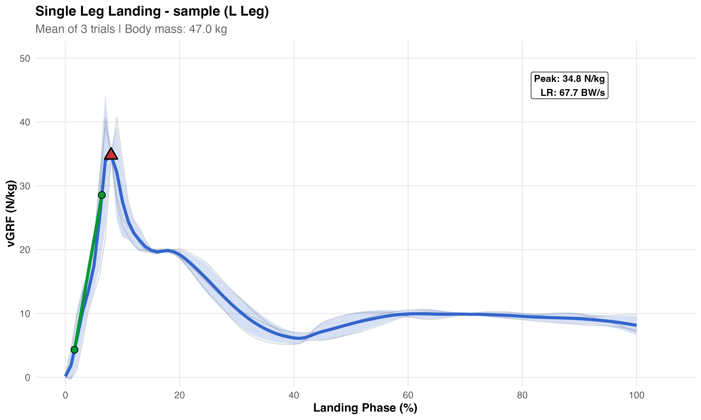

# loading_rate

# Single Leg Landing vGRF Analysis

R script for processing vertical ground reaction force data from single leg landing trials. Calculates time-normalized mean waveforms and loading rates from Vicon Nexus force plate exports.

## What It Does

- Processes multiple trial CSV files from a directory
- Extracts landing phase using foot strike/foot off events
- Normalizes force to body mass (N/kg)
- Time-normalizes each trial to 0–100% of landing phase
- Calculates mean ± SD waveform across trials
- Computes loading rate (20–80% of rise to peak) in BW/s

## Requirements

```r
install.packages(c("ggplot2", "dplyr", "openxlsx"))
```

## Usage

1. Place your trial CSV files in the `data/` folder
2. Open `sll_vgrf_analysis.R` and modify the user settings:

```r
input_dir <- "data/"
output_dir <- "output/"
subject_id <- "sample"
body_mass_kg <- 70
landing_leg <- "R"  # "R" or "L"
```

3. Run the script

## Input Format

CSV files exported from Vicon Nexus with:
- **Events section**: Foot Strike and Foot Off event times
- **Devices section**: Force plate data (Fx, Fy, Fz, Mx, My, Mz, Cx, Cy, Cz for each plate)

The script assumes a dual force plate setup with left plate data in columns 3–11 and right plate in columns 12–20.

## Output

Results are saved to the `output/` folder:

| File | Contents |
|------|----------|
| `[subject]_[leg]_sll_vGRF_results.xlsx` | Mean time series (Sheet 1) and loading rate metrics (Sheet 2) |
| `[subject]_[leg]_sll_vGRF_plot.png` | Mean waveform with SD ribbon, individual trials, and loading rate annotation |

## Example Output



## Metrics

| Metric | Unit | Description |
|--------|------|-------------|
| Peak vGRF | N/kg | Maximum force during landing phase |
| Loading Rate | BW/s | Slope from 20% to 80% of rise to peak, normalized to body weight |

## License

MIT
